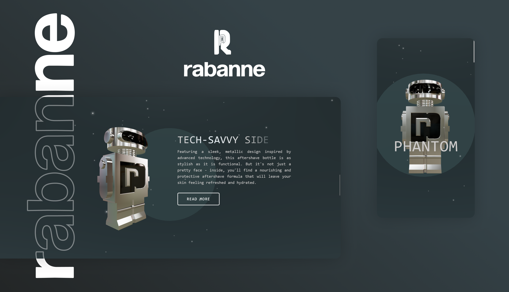

# 3D Paco Rabanne Landing Page
> A modern [Next.js](https://nextjs.org/) and [Three.js](https://threejs.org/) web application for creating a stunning 3D landing page for Paco Rabanne, built with React, GSAP, and Tailwind CSS.


---

## 📸 Preview

<!-- Replace with an actual screenshot or GIF -->


---

## ✨ Features

- **3D Model Rendering:** Renders a 3D model of a Paco Rabanne Fragrance.
- **Scroll-based Animations:** The 3D model animates based on the user's scroll position.
- **Responsive Design:** The layout is responsive and works on mobile devices.

---

## 🚀 Live Demo

Check out the live version here:
**[🔗 Live Project](https://paco-rabanne-landing.vercel.app/)**

---

## 🛠️ Tech Stack

- **Framework:** [Next.js](https://nextjs.org/) `^13`
- **UI Library:** [React](https://react.dev/) `^18`
- **3D:** [Three.js](https://threejs.org/) `^0.148.0`, [@react-three/fiber](https://docs.pmnd.rs/react-three-fiber/getting-started/introduction) `^8.10.0`, [@react-three/drei](https://github.com/pmndrs/drei) `^9.52.3`
- **Animation:** [GSAP](https://greensock.com/gsap/) `^3.11.4`
- **Styling:** [Tailwind CSS](https://tailwindcss.com/) `^3.3.3`
- **Deployment:** [Vercel](https://vercel.com/)

---

## 📁 Project Structure

```bash
├─ app/                # Next.js App Router pages
│  ├─ globals.css      # Global styles
│  ├─ layout.js        # Root layout
│  └─ page.js          # Main page
├─ components/         # Reusable UI components
│  ├─ index.js         # Component exports
│  ├─ Render.jsx       # Renders the 3D scene
│  └─ Robot.jsx        # 3D Robot component and animation
├─ public/             # Static assets
│  └─ models/          # 3D models
└─ ...
```

---

## ⚙️ Getting Started

### ✅ Prerequisites

* Node.js (v18.x or later)
* npm / yarn / pnpm

### 🧰 Installation

1. Clone the repository:

   ```bash
   git clone https://github.com/jkvdev/Paco-Rabanne-Landing.git
   ```
2. Navigate to the project directory:

   ```bash
   cd ./Paco-Rabanne-Landing/
   ```
3. Install the dependencies:

   ```bash
   npm install
   ```

### 🔐 Environment Variables

This project does not require any environment variables.

### ▶️ Running the Development Server

```bash
npm run dev
```

Visit [http://localhost:3000](http://localhost:3000) to view it in your browser.

---

## 💡 Key Learnings & Challenges

* Integrating Three.js with Next.js for 3D rendering in a React environment.
* Creating smooth, scroll-based animations using GSAP.
* Optimizing the loading and performance of 3D models for the web.
* Ensuring a responsive design for a 3D-heavy application.

---

## 🗺️ Roadmap

* [ ] Add a loading screen while the 3D model is loading
* [ ] Implement more complex animations and user interactions
* [ ] Add more sections to the landing page
* [ ] Implement different theme functionality with tailwind
* [ ] Optimize performance for a wider range of devices

---

## 📝 License

This project is licensed under the MIT License. See the [LICENSE](LICENSE) file for details.

---

## 📬 Contact

**Valentin Costea** – [Portfolio](https://jkvdev.com) – [jkv21contact@gmail.com](mailto:jkv21contact@gmail.com)